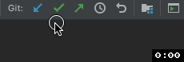

## Instructions

**All of your tasks are to be done in the file `src/main/java/Basics.java`.** For your convenience,
we have labelled each task with a **TODO** and included instructions at the top of the file.

For this exercise, you can either complete it through the GitHub UI or run it through IntelliJ (recommended).

After finishing this exercise, make sure you also finish the related **Quercus quiz**.

### Readings
You will want to read through **[Chapter 1: Introduction to Java](https://github.com/CSC207-UofT/207-course-notes/blob/master/01-introduction-to-java.md)**.

For each of the tasks in `Basics.java`, we have included a brief summary of the relevant reading to
help you.

### Doing this exercise in IntelliJ

- In IntelliJ, create a new project by selecting "Get from version control" (If you already have a project open, close your current project ("File" --> "Close Project")
- Make sure "Version control" is set to "Git"
- In this GitHub repo, press the green "Code" button in the top right and copy the https url to the clipboard and then into IntelliJ.
- IntelliJ will automatically create a directory for your project on your computer (to keep your files organized you can choose where to save it if you want or just use the default)
- Click Clone to setup your project.
- You will be prompted to enter your Github username and password to complete the setup. If this does not work, you may need to use an [Access Token](https://docs.github.com/en/github/authenticating-to-github/keeping-your-account-and-data-secure/creating-a-personal-access-token) instead.
- IntelliJ should detect the `build.gradle` file and automatically set up the project for you, but this may take a bit of time.
- You should now be able to run `Basics.java` and its associated unit tests in `BasicsTest.java`. Open `Basics.java` and make the changes needed in order for all of the tests to pass.
- When you are done, commit and push your code using IntelliJ's git integration from the menu bar.

  
  
  - After you press the green checkmark, you need to fill in a commit message and press Commit (or Commit and Push...) in the menu that appears in IntelliJ.
  - After you push, you should see an update in the bottom right corner indicating whether or not anything was pushed. "Everything is up to date" means there were no new commits to push. 
